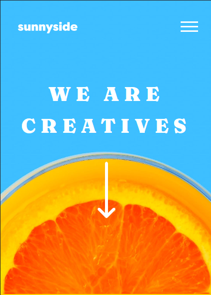
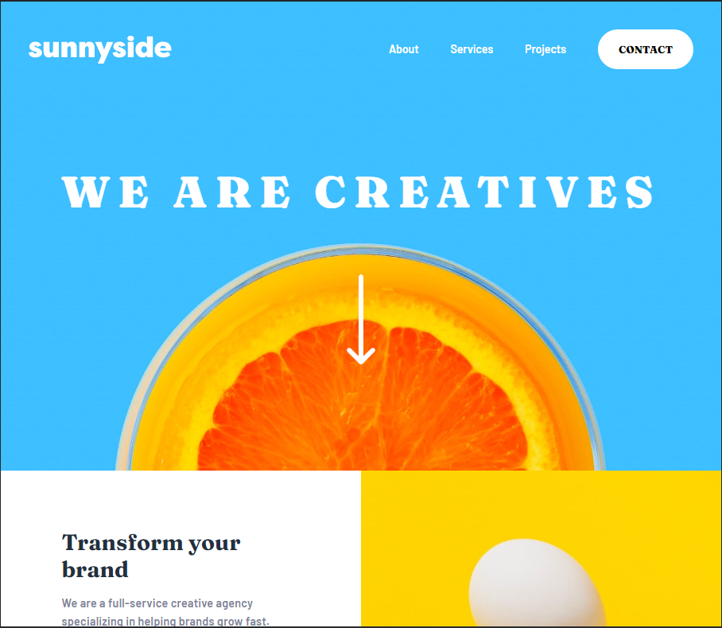

# Frontend Mentor - Sunnyside agency landing page solution

## Table of contents

- [Overview](#overview)
  - [The challenge](#the-challenge)
  - [Screenshot](#screenshot)
  - [Links](#links)
- [My process](#my-process)
  - [Built with](#built-with)
  - [What I learned](#what-i-learned)
- [Author](#author)
- [Acknowledgments](#acknowledgments)

## Overview

### The challenge

Users should be able to:

- View the optimal layout for the site depending on their device's screen size
- See hover states for all interactive elements on the page

### Screenshot

### Links

- Live Site URL: [LIVE SITE](https://sunnysideagency-suatcg.netlify.app/)
- Solution URL: [FrontEnd Mentor](https://www.frontendmentor.io/solutions/sunny-side-agency-7WDLI5_bmJ)

## My process

### Built with

- SASS
- Javascript
- BEM
- Semantic HTML5 markup
- CSS custom properties
- Flexbox
- CSS Grid
- Desktop-first workflow

### What I learned

This's my first project that I've used SASS preprocessor and BEM methodoly together, so I could divide each section according to the their purpose and It helped me to write less code which is essential for DRY principle , therefore I used some of utilities without write same functionality again. Meanwhile this project sharpened my grid and flex feature , even though I know all usability sometimes you could forget subtle feature. Beside all of these stuff I get used work with image when they don't fit in terms of responsiveness and screen sizes. Instead of coping with tutorial hell , you would try it out by yourself with this kind of small projects that ease your coding skills no matter how they are difficult.

## Author

- LinkedIn - [Suat Can Geyik](https://www.linkedin.com/in/suatcangeyik/)
- Frontend Mentor - [@suatcg](https://www.frontendmentor.io/profile/suatcg)
- Twitter - [@suatcg](https://twitter.com/suatcg)

## Acknowledgments

I gave my best though, I've been coping with last image section before the footer , I could not fit to full of the screen size If you find any solution of this little issue you would send me message whenever you want.

Sincerely.
